# Choreography Saga 

In Choreography-based Saga, each service involved in the transaction communicates with other services directly to determine its actions. 
Each service is responsible for its own local transaction and emits events to trigger actions in other services.

In this Project there are 3 services:
1) Order Service
2) Account Service
3) Inventory Service

## Pre-requisites
1) RabbitMQ running locally or inside the container.
2) Create 3 queues
    a) ch-inventory-queue
    b) ch-account-queue
    c) ch-order-queue

## Working
- The Order Service is the first service.
- It receives the order which includes accountId, ProductId , Quantity of the product.
- It then sends OrderEvent to ch-inventory-queue .
- The inventory-service subscribes to ch-inventory-queue 
- If the inventory-service is able to complete the transaction it updates the inventory status as SUCCESSFUL in the OrderEvent and publishes to ch-account-queue
- If the inventory-services fails to complete the transaction it updates the inventory status as FAILED in the OrderEvent and publishes to ch-order-queue
- The account-service subscribes to ch-account-queue.
- If the account-service is able to complete the transaction it updates the account status as PAYMENT_SUCCESSFUL in the OrderEvent and publishes to ch-order-queue
- If the account-services fails to complete the transaction it updates the account status as PAYMENT_FAILED in the OrderEvent and publishes to ch-inventory-queue
- The inventory-services then rollback the transaction and updates the inventory-status as ROLLEDBACK in the OrderEvent and publishes to ch-order-queue
- The order-service subscribes to the ch-order-queue.
- If any of the inventory-service or account-service reports FAILED transaction, it updates the order ORDER_CANCELLED status.
- If both the inventory status and account-status are SUCCESSFUL then the Order is considered as ORDER_COMPLETED.

## Steps:
- Maven Build all the 3 services.
- Run the RabbitMQ on local machine or inside docker container.
- Run Maven Build of Order Service with -DskipTests=true or start Product Service and Account Service before running the maven build of Order Service.
- Start all the 3 services:
- Open Brower and create order

## Tests

There are 4 scenarios:

1) Happy Scenario : Both Inventory Service and Account Service were able to complete the transation.
`http://localhost:8082/createOrder?accountId=1&productId=1&quantity=5`

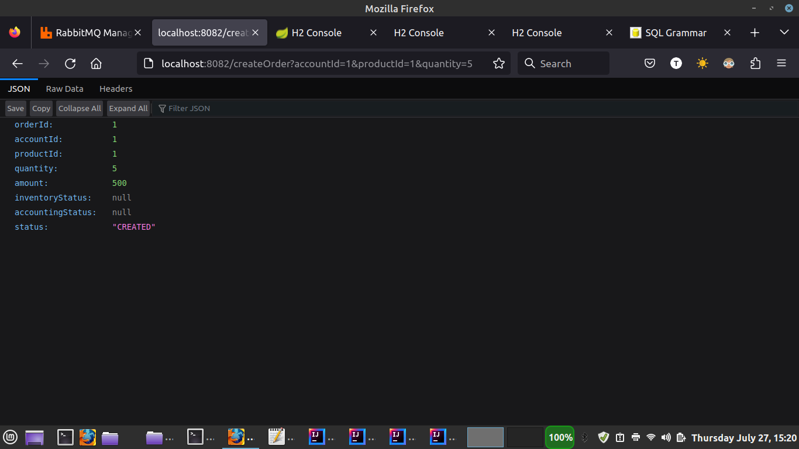
The order is completed
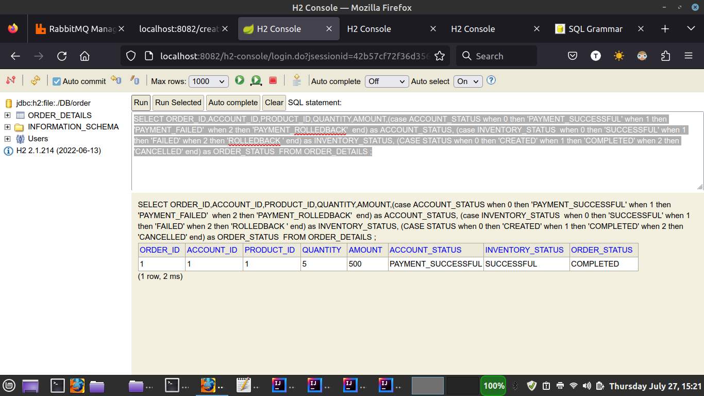
The inventory service transaction is SUCCESSFUL.
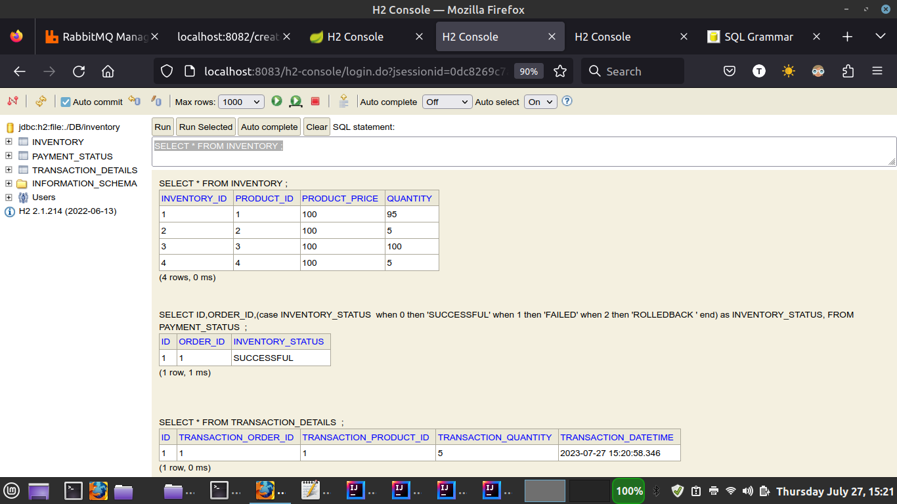
The account service transaction is SUCCESSFUL.
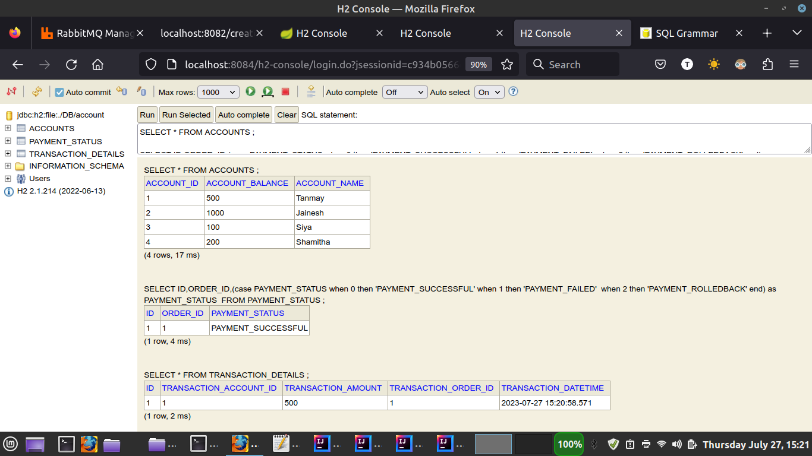
Final order status

2) Failure Scenario 1 : Inventory Service reported less product in inventory than ordered value. Account Service has sufficient balance in the account.
`http://localhost:8082/createOrder?accountId=2&productId=2&quantity=8`

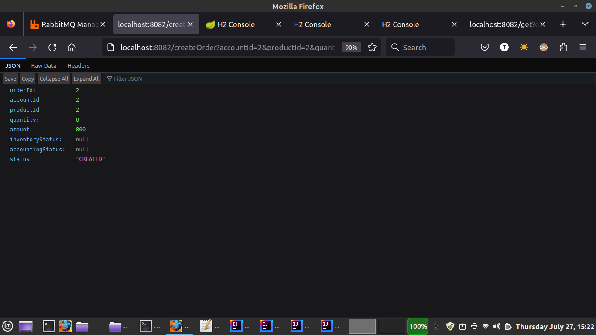
The order is CANCELLED
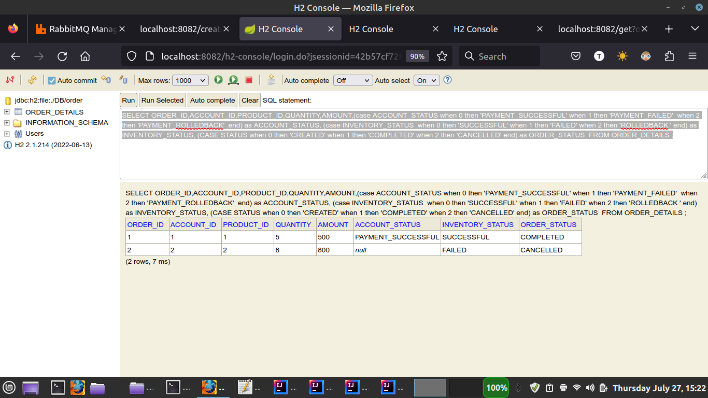
The inventory service transaction is FAILED.
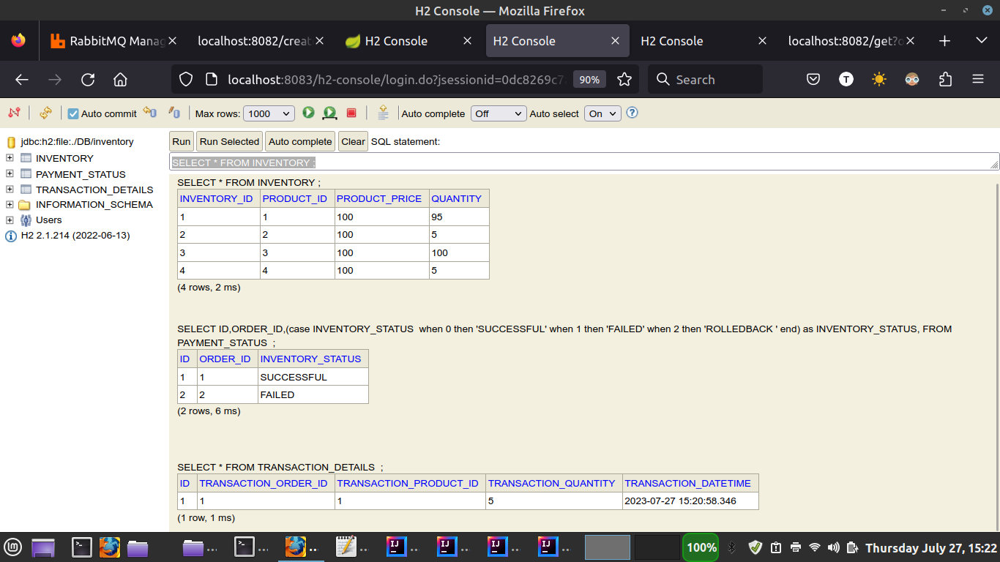
The account service have not received the transaction as the previous step of inventory service was failed.
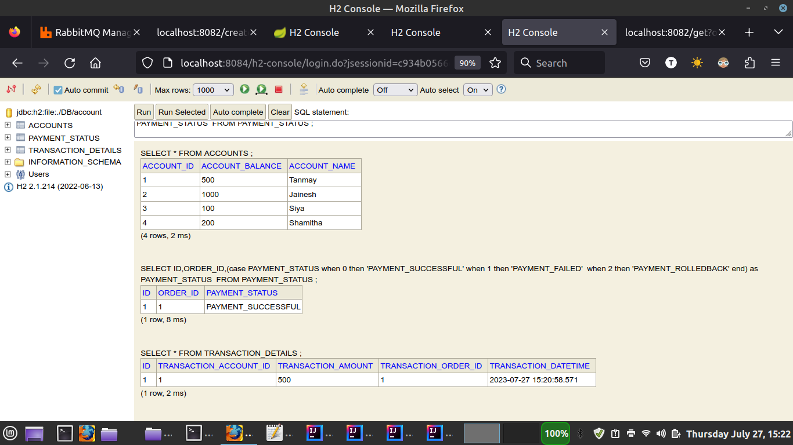
Final status of the order is CANCELLED.
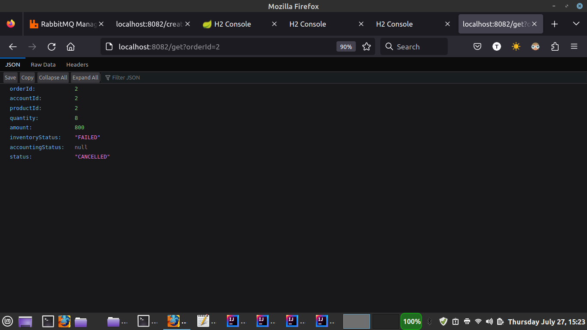

3) Failure Scenario 2 : Inventory Service reported sufficient product quantity in inventory than ordered value. Account Service reported in-sufficient balance in the account.
`http://localhost:8082/createOrder?accountId=3&productId=3&quantity=5`

The order is CANCELLED
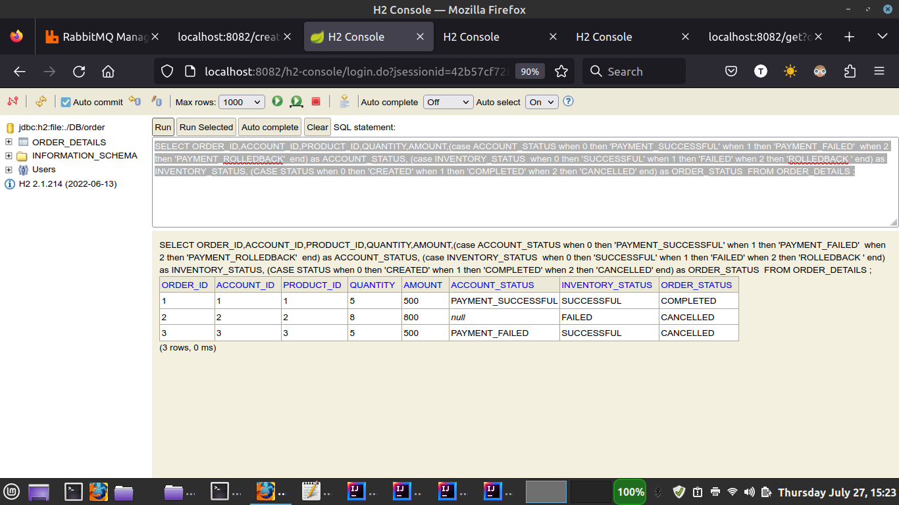
The inventory service transaction was SUCCESSFUL but since Account was PAYEMNT_FAILED this was also ROLLEDBACK.
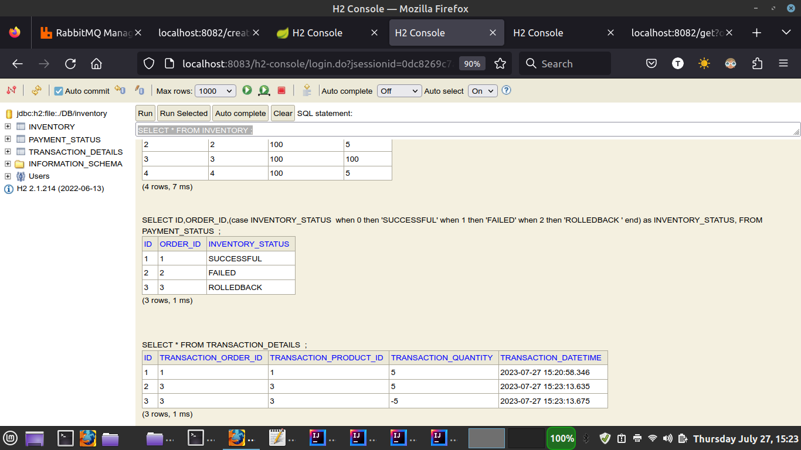
The account service transaction is PAYMENT_FAILED

Final status of the order is CANCELLED.
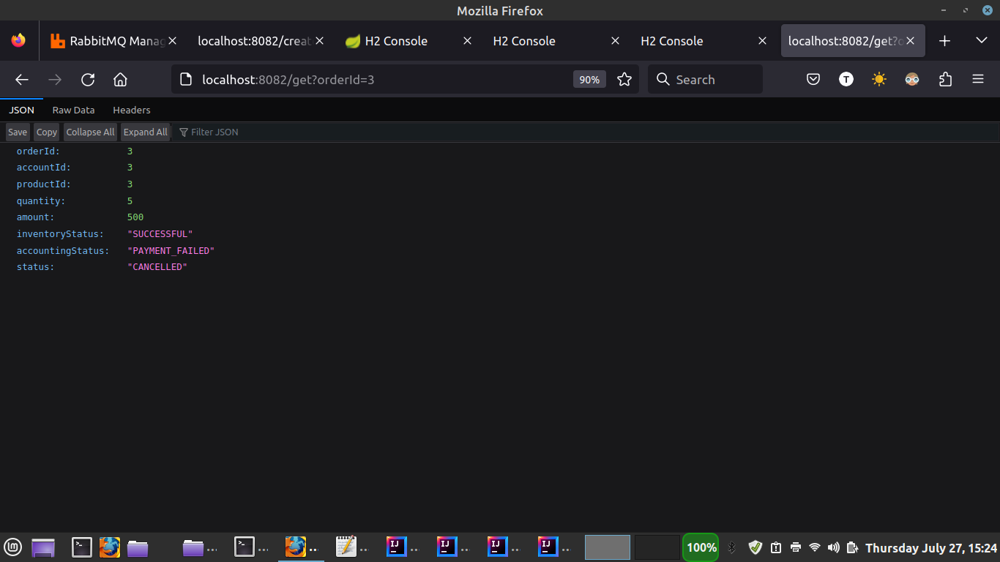

4) Failure Scenario 3 : Inventory Service reported in-sufficient product quantity in inventory than ordered value. Account Service reported in-sufficient balance in the account.
`http://localhost:8082/createOrder?accountId=4&productId=4&quantity=8`

The order is CANCELLED
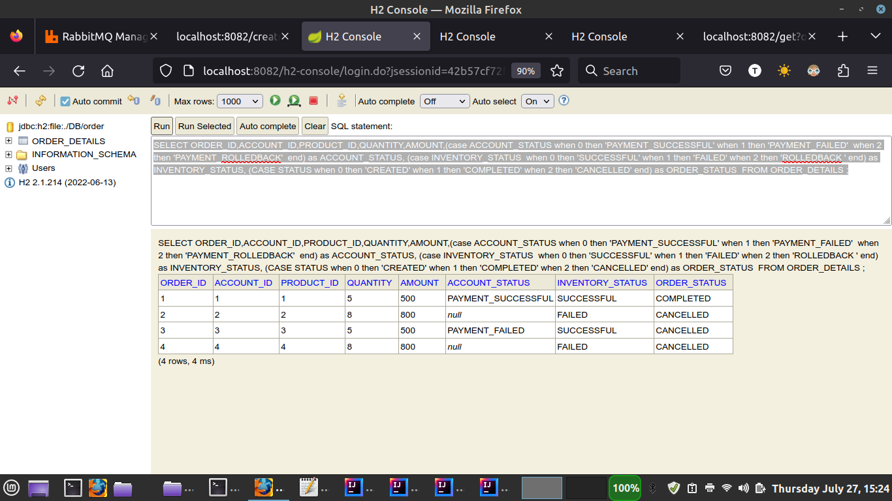
The inventory service transaction was FAILED 

The account service have not received the transaction as the previous step of inventory service was failed.
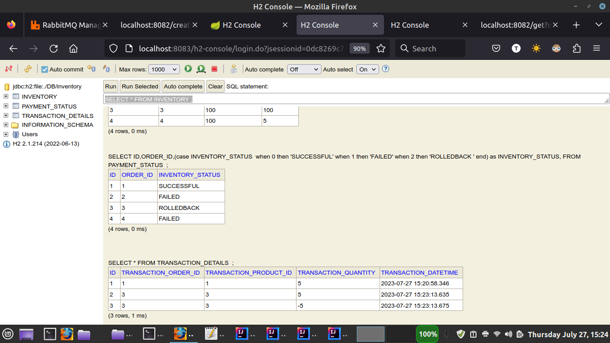
Final status of the order is CANCELLED.
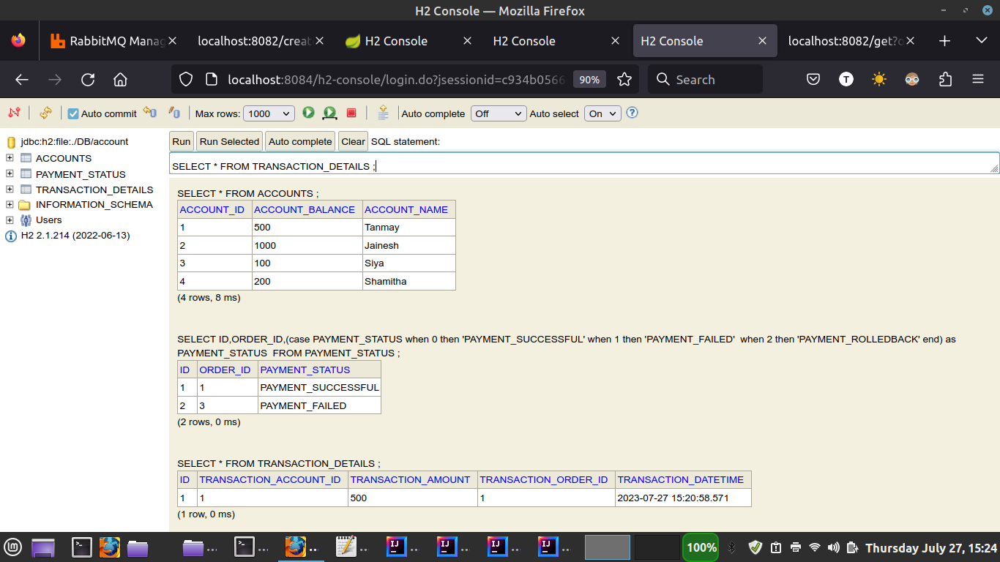

## QUERIES

###ORDER DATABASE

SELECT ORDER_ID,ACCOUNT_ID,PRODUCT_ID,QUANTITY,AMOUNT,(case ACCOUNT_STATUS when 0 then 'PAYMENT_SUCCESSFUL' when 1 then 'PAYMENT_FAILED'  when 2 then 'PAYMENT_ROLLEDBACK'  end) as ACCOUNT_STATUS, (case INVENTORY_STATUS  when 0 then 'SUCCESSFUL' when 1 then 'FAILED' when 2 then 'ROLLEDBACK ' end) as INVENTORY_STATUS, (CASE STATUS when 0 then 'CREATED' when 1 then 'COMPLETED' when 2 then 'CANCELLED' end) as ORDER_STATUS  FROM ORDER_DETAILS ;

###INVENTORY DATABASE

SELECT * FROM INVENTORY ;

SELECT ID,ORDER_ID,(case INVENTORY_STATUS  when 0 then 'SUCCESSFUL' when 1 then 'FAILED' when 2 then 'ROLLEDBACK ' end) as INVENTORY_STATUS, FROM PAYMENT_STATUS  ;

SELECT * FROM TRANSACTION_DETAILS  ;

###ACCOUNTS DATABASE

SELECT * FROM ACCOUNTS ;

SELECT ID,ORDER_ID,(case PAYMENT_STATUS when 0 then 'PAYMENT_SUCCESSFUL' when 1 then 'PAYMENT_FAILED'  when 2 then 'PAYMENT_ROLLEDBACK' end) as PAYMENT_STATUS  FROM PAYMENT_STATUS ;

SELECT * FROM TRANSACTION_DETAILS ;

